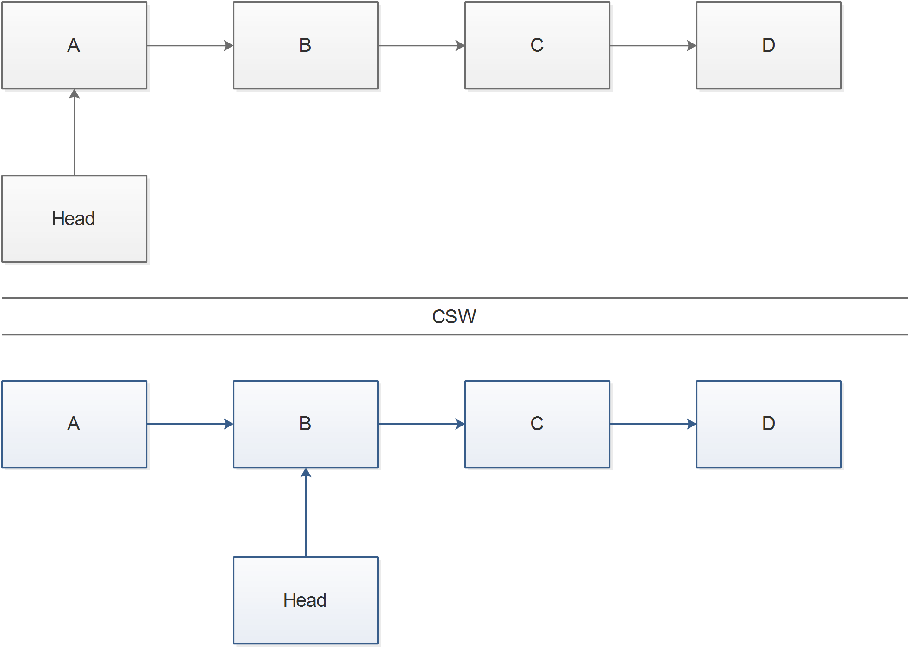
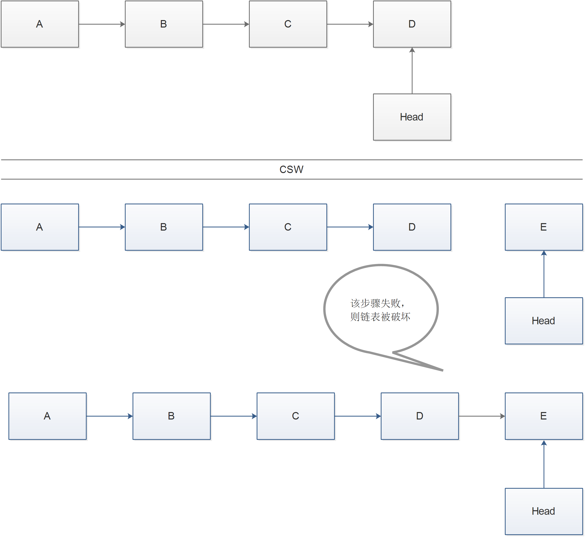
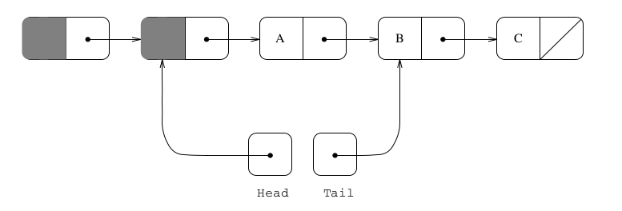

# 论文核心内容
数据的并发更新即数据竞争一直是多线程编程中的一大头痛的问题.

简单的处理方式是加锁, 在临界区进行独占访问. 而加锁带来了性能问题, 在独占了数据的进程(线程)是一个运行缓慢甚至停滞的操作. 那么其他的进程也会被阻止访问.

那么无锁数据结构则是一个重要的应用.

无锁数据类型有两个重要的属性:
* 非阻塞(no-blockind)
    非阻塞即数据一直是可访问的, 某个慢速进程的访问不对妨碍其他进程
* 无等待(no-waiting)
    无等待即进程不会等待数据准备好, 但数据一直没有准备好引起的饥饿问题.

此外论文中还使用了两个原子原语: FAA, CSW(大多数成为CAS)
FAA即是Fetch&Add, 
CSW即是Compare&Swap
这里就不细讲了, 必备的基础知识.

## 引文18, 8
该参考文献提出了一种简单的无锁队列, 但是在队列为空的时候会出现问题, 并且可能存在破坏链表的情况.
* 出队操作
    使用一个CSW操作将head指针后移, 第一个节点即出列成功
* 入队操作
    使用一个CSW操作将tial指针指向要入队的新节点, 然后将新节点入队.

出队操作如下图所示.


入队操作如下图所示.



可以看到, 在入队操作中, 如果某一个进程将新节点加入链表失败, 那么整个链表就被分成了两段, 即链表被破坏.

## 引文16
* 入队操作
    1. 使用CSW将节点加入链表
    1. 使用CSW更新tail指针(失败不重试, 失败就意味着其他的进程更新了tail指针)
*  出队操作
    1. 使用一个CSW操作将head指针后移, 第一个节点即出列成功

该论文的问题在于快照上, 会造成冲突, 并且影响性能.(未看过该论文, 不清楚具体实现, 不做评论)

## 本文算法
论文的链表模型如下图所示:


上图已经出队了一个元素,并且有元素入队, 已经加入了链表, 处于tail指针未更新的状态.

可以看到, 该链表在头部有一个假节点, 即数据部分是深灰色的节点. 

该假节点解决了空队列的情况, 在没有假节点的情况下, 一旦对列为空, 那么head和tail指针没有能够指向的对象. 该假节点也是链表实现中一种常见的技术.

出队操作不再描述, 只需要一次CSW即可.

入队操作伪代码如下:
```
Enqueue(x)
    q <- new record
    q^.value <- x
    q^.next <- NULL

    repeat
        p <- tail
        succ <- CSW(p^.next, NULL, q)
        if succ != True then
            CSW(tail, p, p^.next)
        end
    until succ == True
    CSW(tail, p, q)
end
```
下面对上面的代码进行分析.

首先, 构造一个新节点q, 毋庸置疑, 这里是不会引发数据竞争的, 只要调用`Enqueue`时传入的参数不是会引发数据竞争并且传入多次.

接下来是循环部分, 首先获取尾指针赋值给p, 等于就是在函数内部取得了一个尾指针的快照, 读操作也不会引发数据竞争. 

在然后就是一个CSW, 判断p的next指针是否是NULL, 即p是否还是尾指针, 如果是那么将新节点加入到链表中, 这是一个原子操作. 如果p不是尾指针, 那么说明有别的进程加入了新节点.

下面的一段代码可能会造成困惑, 这一段代码用于处理链表处于其他进程加入了新节点但是还没有更新尾指针的中间状态. 如果成功, 那么就更新了尾指针, 如果失败, 那么就表明其他的进程更新过了尾指针.
```
if succ != True
    CSW(tail, p, p^.next)
```
循环一直执行到将新节点加入到链表中为止

然后执行`CSW(tail, q, p)` 尝试更新尾指针, 失败不重试.

至此, 队列的入队和出队操作就能够无锁并发了.


> 作者在文中还提到了, 上述的入队操作存在这性能问题, 第二个CSW指令会因为频繁调用, 最终影响性能, 实际上, 该指令是多余的. 但是删去该指令又会破坏掉非阻塞属性, 那么解决方案就是减少调用第二次指令的次数, 使用循环计数, 在失败几次之后调用第二条指令.

最终代码如下:
```
RRTRY_MAX <- 5

Enqueue(x)
    q <- new record
    q^.value <- x
    q^.next <- NULL
    times = 0
    repeat
        p <- tail
        succ <- CSW(p^.next, NULL, q)
        if succ != True then
            times <- times + 1
            if times > RETRY_MAX then
                CSW(tail, p, p^.next)
                times = 0
            end
        end
    until succ == True
    CSW(tail, p, q)
end
```

## ABA 问题

CSW常用于以下用途, 读取一个指针只想的数据结构, 做一些计算来决定如何改变数据结构, 然后CSW用于在指针没有改变为临时值的时候将新值写入.  由于CSW指令并不能真正的确保指针没有被改变, 仅仅是一定是某一个值的问题. 如果指针被改变了, 但是有着原始值相同的值,那么CSW会在本该失败的地方成功.

在论文的算法中, 出现ABA的问题就是内存管理的问题, 考虑一个尝试出队操作的进程,. 该进程将会读取head 的值,来确定链表的第二个节点的地址(地一个节点的next指针), 然后使用CSW来将head指向第二个节点, 如果head改变了(因为其他进程完成了出队操作), 那么CSW指令将会失效. 但是，假设构成列表上第一个节点的内存块是“已回收”并重新用作排队的新节点（在我们的进程已经读取了head指针之后，但在它尝试CSW之前）。 如果这个节点恰好一直运行到列表的前面，那么当我们的进程执行其CSW时，它将成功，很可能破坏链表结构.

论文的解决方案就是使用引用计数来保证只要还有进程访问该节点, 那么节点就不会被释放, 那么就不会出现A进程释放了内存地址, 被B进程使用又加入了链表, 然后C进程使用CSW引发ABA问题.